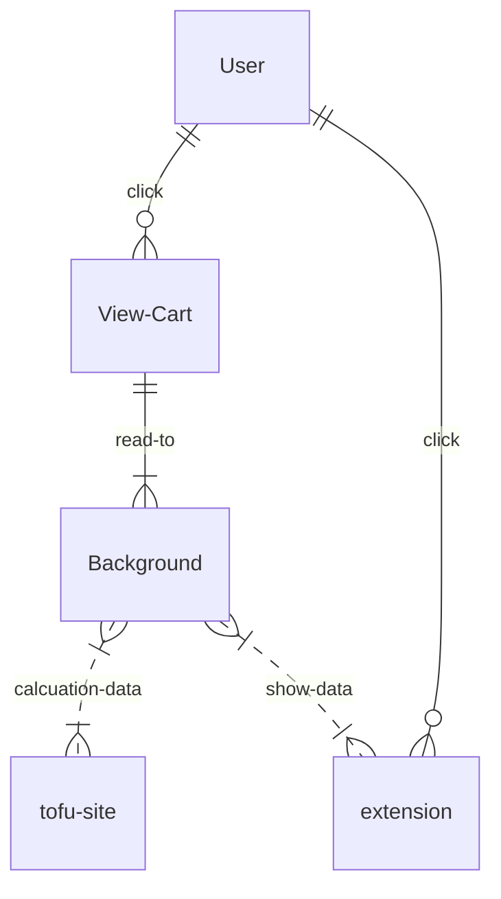
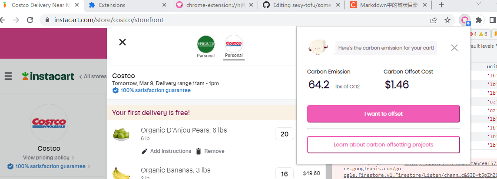
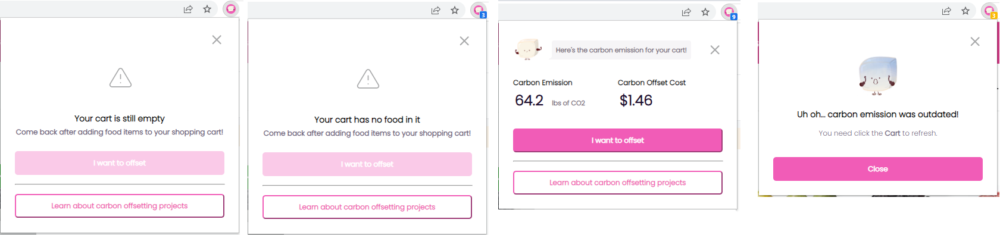

# <center>Sexy-tofu Chrome Extension</center>

## 1. Introduce
   This extension work along with [instacart](https://www.instacart.com/) site. It's lead by the sexy-tofu team at: https://www.sexytofu.org/

## 2. Extension related
    The extension developement with JavaScript. Use the Chrome api to support the extension functions. So far, not use the jQuery.
  <details><summary>Click to check the detail code structure...</summary>
  Detail struct is here:
  
```
$Web-plugin\
│  manifest.json
│  package-lock.json
│  package.json
│  readme.MD
│  
├─demo
│      index.html
│      index.js
│      
├─fonts
│      OFL.txt
│      Poppins-Black.ttf
│      Poppins-BlackItalic.ttf
│      Poppins-Bold.ttf
│      Poppins-BoldItalic.ttf
│      Poppins-ExtraBold.ttf
│      Poppins-ExtraBoldItalic.ttf
│      Poppins-ExtraLight.ttf
│      Poppins-ExtraLightItalic.ttf
│      Poppins-Italic.ttf
│      Poppins-Light.ttf
│      Poppins-LightItalic.ttf
│      Poppins-Medium.ttf
│      Poppins-MediumItalic.ttf
│      Poppins-Regular.ttf
│      Poppins-SemiBold.ttf
│      Poppins-SemiBoldItalic.ttf
│      Poppins-Thin.ttf
│      Poppins-ThinItalic.ttf
│      
├─img
│      128x128.png
│      16x16.png
│      48x48.png
│      close.svg
│      gray-filler-img.png
│      Sexy_Tofu_2.png
│      Sexy_tofu_dither.png
│      triangle.svg
│      
├─js
│      background.js
│      common.js
│      content.js
│      jquery-3.6.0.min.js
│      popup.js
│      
└─popup
        empty.css
        empty.html
        error.css
        error.html
        offset.css
        offset.html
        Outdated.css
        Outdated.html
        payment-success.css
        payment-success.html
```
    
</details>

### The workflow like:
    This extension now works with instacrt site. It read the cart items, and load related carbon emmission info to the extension.



### Screen shots:



## 3. Analysis & Debug Tips

### 3.1 We can use manual query the food carbon info
 Copy below code put to develop console, and modify the food name than you can return to send the request.

```
fetch(`https://api.sexytofu.org/api.ghgi.org:443/rate`,
{
method: 'POST',
body: '{"recipe":["1 lb Container of Strawberries"]}'
}).then(res => res.json()).then(json => console.log(json.items[0]))
```

Capture about run this in instacart's F12 (devloper mode console page.)


### 3.2 Use the demo page help development
In demo page can support some developement work. The functions can and may support are: 
- [x] add/clear items
- [x] change bage text & bage background color
- [ ] change bage text color
- [ ] set popup status
- [ ] set request status
- [ ] more ideas?

### 3.3 Logs

 * If found read cart items faild, please check log for content.js.  At instacart page, press `F12` to open developer console.
  
 * If want know more data request logs, better look into the background.js log.
  You need move to the `chrome://extensions/` page, and click `service worker` on the `Inspect views`.
  Capture:
  
  Here also we can know the request status in the background related `Network` tab.
  

### 3.4 Want know more about GHGI API?

you can reference to here: https://github.com/ghgindex/ghgi/blob/main/ghgi/datasets/master/products.json

Sexy-tofu site have embedded this content in our site. The simple data as below: 

```
    "bananas": {
        "g": 180,
        "names": [
            "banana",
            "bananas",
            "plantain"
        ],
        "sg": 0.9,
        "super": {}
    },
```