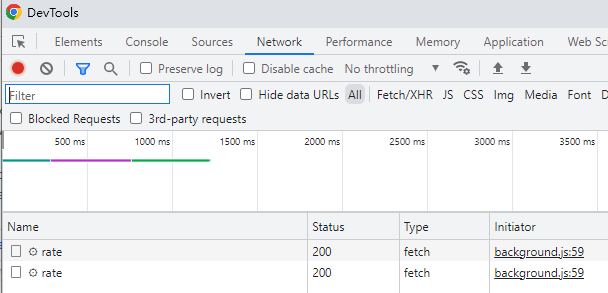

<h1 align="center">Sexy Tofu Carbon Calculator </h1>

## Table of Content

- [1. Introduce](#1-introduce)
- [2. Extension Related](#2-extension-related)
  - [Code Structure](#code-structure)
  - [Work Diagram](#work-diagram)
  - [Screenshots](#screenshots)
  - [Pack the extension](#pack-the-extension)
- [3. Analysis & Debug Tips](#3-analysis--debug-tips)
  - [3.1 We can manual query the food carbon info](#31-we-can-manual-query-the-food-carbon-info)
  - [3.2 Use the demo page help development](#32-use-the-demo-page-help-development)
  - [3.3 Logs](#33-logs)
  - [3.4 Want know more about GHGI API?](#34-want-know-more-about-ghgi-api)
  - [3.5 How to open demo page](#35-how-to-open-demo-page)
  - [3.6 Scraper the instacart site](#36-scraper-the-instacart-site)

## 1. Introduce

This extension work along with [instacart](https://www.instacart.com/) site. It's lead by the sexy-tofu team at: https://www.sexytofu.org/

## 2. Extension Related

The extension developement with JavaScript. Use the Chrome api to support the extension functions.

### Code Structure

  <details><summary>Click to check the detail code structure...</summary>
  
```
$Web-plugin\
│  manifest.json
│  package-lock.json
│  package.json
│  exclude.txt
│  packFile.bat
│  readme.MD
├─demo
│      index.html
│      index.js
├─fonts
│      OFL.txt
│      Poppins-Black.ttf
│      Poppins-BlackItalic.ttf
│      Poppins-Bold.ttf
│      Poppins-BoldItalic.ttf
│      Poppins-ExtraBold.ttf
│      Poppins-ExtraBoldItalic.ttf
│      Poppins-ExtraLight.ttf
│      Poppins-ExtraLightItalic.ttf
│      Poppins-Italic.ttf
│      Poppins-Light.ttf
│      Poppins-LightItalic.ttf
│      Poppins-Medium.ttf
│      Poppins-MediumItalic.ttf
│      Poppins-Regular.ttf
│      Poppins-SemiBold.ttf
│      Poppins-SemiBoldItalic.ttf
│      Poppins-Thin.ttf
│      Poppins-ThinItalic.ttf
├─img
│      128x128.png
│      16x16.png
│      48x48.png
│      close.svg
│      gray-filler-img.png
│      error-tofu.png
│      dither-tofu.png
│      triangle.svg
├─js
│      background.js
│      common.js
│      content.js
│      jquery-3.6.0.min.js
│      popup.js
├─mdImg
│      backgroundlog.png
│      backgroundlogrequest.png
│      contentJs.png
│      demopage.png
│      Overview.png
│      screens.png
└─popup
        empty.css
        empty.html
        error.css
        error.html
        offset.css
        offset.html
        Outdated.css
        Outdated.html
        payment-success.css
        payment-success.html
```
    
</details>

### Work Diagram

This extension now works with instacrt site. It read the cart items, and load related carbon emmission info to the extension.


### Screenshots


### Pack the extension

There is a Windows batch file: `packFile.bat`, we can use this file to pack the extension. Now the batch file will zip a `ZIP` file & a `CRX` file. Packed `CRX` file mostly only can used by Lnux user.

The files generated by the batch file:


About CRX now only support in Linux file: https://developer.chrome.com/docs/extensions/mv3/linux_hosting/

The Google Webstore need a ZIP file to upload. We can upload from here:
https://chrome.google.com/webstore/devconsole

## 3. Analysis & Debug Tips

### 3.1 We can manual query the food carbon info

Copy below code put to develop console, and modify the food name than you can return to send the request.

```
fetch(`https://api.sexytofu.org/api.ghgi.org:443/rate`,
{
method: 'POST',
body: '{"recipe":["1 lb Container of Strawberries"]}'
}).then(res => res.json()).then(json => console.log(json.items[0]))
```

Capture about run this in instacart's F12 (devloper mode console page.)


### 3.2 Use the demo page help development

In demo page can support some developement work. The functions can and may support are:

- [x] add/clear items
- [x] change badge text & badge background color
- [x] change badge text color
- [x] set popup status
- [x] show carts status
- [x] set request status (reuse set popup status)
- [ ] more ideas?

### 3.3 Logs

We have many logs, mostly in the background.js for debug and so on. Content.js inject to the instacart site, and popup page also will have some log for show the popup page status.

- If found read cart items faild, please check log for content.js. At instacart page, press `F12` to open developer console.

  
- If want know more data request logs, better look into the background.js log.
  You need move to the `chrome://extensions/` page, and click `service worker` on the `Inspect views`.

  

  Here also we can know the request status in the background related `Network` tab.
  
  
- If you want know more about the popup pages, just right click on the popup page, and select `Inspect`.

### 3.4 Want know more about GHGI API?

you can reference to here: https://github.com/ghgindex/ghgi/blob/main/ghgi/datasets/master/products.json

Sexy-tofu site have embedded this content in it. The simple data as below:

```
    "bananas": {
        "g": 180,
        "names": [
            "banana",
            "bananas",
            "plantain"
        ],
        "sg": 0.9,
        "super": {}
    },
```

### 3.5 How to open demo page

Now the demo page will not auto open when install/update the extension. If you want to open the demo page, you can manual open in browser as input the url as:

```
chrome-extension://njflfnebkbnlfhcflaihoccnecpiogen/demo/index.html
```

But notice, the ID as `njflfnebkbnlfhcflaihoccnecpiogen` may vary when we install the extension.

Another way is try to send a message to `background.js` in chrome developer tool. code as below:

```
chrome.runtime.sendMessage({
       Debug: "on"
   })
```

### 3.6 Scraper the instacart site
For reserach the instacart site food item name & unit, we need scraper the site, and get the values from the site.

So far, I build a scraper sitemap for it. But not sure why, seem still not dump all data.
The Script as:
 [WebScraper.json](./webscraper.json)

We can use the `Import` to import this sitemap, and use it to scraper the site.


<hr/>

<span align="center">by [Odin:heart:](https://github.com/szjfhb), or you can [Mail Me](mailto:jfhb@msn.com)</span>
